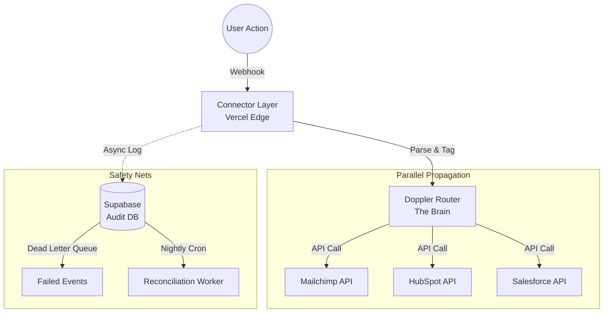

# Meridian Bridge Strategy: The Complete Vision
**Date:** February 13, 2026
**Author:** Sushant Pasumarty, Founder & CEO
**Confidentiality:** Proprietary & Confidential

---

# Table of Contents
1.  [The Core Philosophy: Action-First Compliance](#1-the-core-philosophy-action-first-compliance)
2.  [The Architecture: Distributed Nerve Center](#2-the-architecture-distributed-nerve-center)
3.  [The Technical Moat: Why We Win](#3-the-technical-moat-why-we-win)
    -   Distributed Node Architecture
    -   Loop Prevention Protocol
    -   Doppler Namespacing (Security)
    -   Dead Letter Queue (Resilience)
4.  [The Network Strategy: Domain Dominance](#4-the-network-strategy-domain-dominance)
    -   Active Hubs
    -   RedirectMoats
5.  [The Business Model: Unit Economics](#5-the-business-model-unit-economics)

---

# 1. The Core Philosophy: Action-First Compliance

> "We don't give you a dashboard that eventually syncs your data. We give you a **Nerve Center** that acts on user intent in milliseconds and verifies the truth every night."

### The Problem: "Sync-Later" Compliance
Traditional tools (like OneTrust) wait for a database write, then trigger updates. This introduces 100ms–2s latency and relies on a "hub-and-spoke" model where if the central server fails, everything fails.

### The Solution: "Action-First" Compliance
**MBS Optimistic Execution:** When a user clicks "Revoke":
1.  Edge Function fires API calls instantly to all connected services (Mailchimp, HubSpot, etc.).
2.  Audit logs are written asynchronously to the database.
3.  **Result:** <200ms latency. The user's choice is respected immediately.

> We prioritize the **Spirit of the Law** (User Privacy) over the **Legacy of the Database**.

---

# 2. The Architecture: Distributed Nerve Center

## System Overview



### The Components

1.  **Connector Layer (Vercel Edge)**
    *   Stateless, distributed functions.
    *   One per channel (Mailchimp, WhatsApp, etc.).
    *   Catches webhooks, validates payloads, and passes to Router.
    *   **Scale:** Infinite horizontal scaling.

2.  **Doppler Router (The Brain)**
    *   Stores all API keys in isolated vaults (using Doppler).
    *   Routes consent changes to target channels.
    *   Fires **PARALLEL** API calls for instant propagation.
    *   **Security:** Customer A's keys never touch Customer B's memory.

3.  **Supabase (The Audit Log)**
    *   `consent_events`: Immutable log of every action.
    *   `failed_events`: Dead Letter Queue for retries.
    *   `reconciliation_queue`: Nightly sync tasks.

4.  **MBS Admin Dashboard**
    *   Real-time view of consent propagation.
    *   Interface for managing channels and viewing audit trails.

---

# 3. The Technical Moat: Why We Win

## A. Loop Prevention Protocol
**The Problem:** Mailchimp updates HubSpot -> HubSpot webhook fires -> Updates Mailchimp -> Infinite loop.
**The Solution:** `MBS_NERVE` source tag in every outbound request.

```typescript
// Outbound: Tag it
await hubspot.updateContact(email, { 
  metadata: { source: 'mbs_nerve' } 
});

// Inbound: Check it
if (payload.metadata?.source === 'mbs_nerve') {
  return; // Ignore - we triggered this
}
```

## B. Doppler Namespacing (Multi-Tenancy)
**The Problem:** Managing 1000 customers = 1000 sets of API keys securely.
**The Solution:** Doppler Projects + Configs.
*   `customer_acme`: Keys isolated in their own config.
*   `customer_zerodha`: Keys isolated in their own config.
*   **Result:** Zero cross-contamination.

## C. Retry Logic & Dead Letter Queue
**The Problem:** APIs fail. Network glitches happen.
**The Solution:** 
1.  **Exponential Backoff:** 3 retries (1s, 2s, 4s).
2.  **Dead Letter Queue:** If all retries fail, the event is saved to `failed_events` in Supabase.
3.  **Recovery:** Admin dashboard allows manual replay or investigation. **Nothing is ever lost.**

## D. Nightly Reconciliation
**The Problem:** Webhooks are "best effort." Drift happens.
**The Solution:** A nightly cron job that:
1.  Fetches "Ground Truth" from each channel.
2.  Compares it against the Audit DB.
3.  Fixes any drift automatically.
4.  Logs the reconciliation event.

---

# 4. The Network Strategy: Domain Dominance

We are deploying a **29-Domain Network** to dominate the DPDP keyword landscape in India.

## Active Hubs (12)
These are high-value, functional platforms.

| Domain | Purpose |
| :--- | :--- |
| `dpdpworkshop.com` | **Theater:** High-Ticket Hub |
| `dpdpaudit.co.in` | **Audit Tool:** "Panic Generator" |
| `dpdpbible.com` | **Authority:** Founder's Guide (SEO #1) |
| `dpdpnews.in` | **Newsroom:** Notification Tracker |
| `dpdptemplates.in` | **Store:** Revenue Generator |
| `dpdp.cloud` | **SaaS:** Waitlist & Product |
| `dpdpttraining.in` | **Academy:** DPO Certification |
| `dpdphelp.in` | **Helpdesk:** CTO Q&A |
| `privacypodcast.in`| **Media:** Authority Building |
| `dpdpconsulting.in`| **Service:** HQ / Parent Offering |

## Redirect Strategy (17)
These create an SEO moat, redirecting traffic to the relevant Hub.

*   `dpdp.news` -> `dpdpnews.in`
*   `dpdp.training` -> `dpdptraining.in`
*   `dpdpblog.com` -> `dpdpblog.in`
*   ...and 14 others.

---

# 5. The Business Model: Unit Economics

## Serverless Cost Structure
**Traditional SaaS:** Pay for servers 24/7.
**MBS Nerve Center:** Pay per execution.

| Metric | Cost |
| :--- | :--- |
| Vercel Edge | $0.60 per 1M invocations |
| Supabase | Free tier handles 500K rows |
| Doppler | Free for 5 projects |

## Profitability at Scale
**Scenario:** 1000 Customers.
*   **Revenue:** ₹2.5 Cr / month (at ₹25k/mo avg).
*   **Infrastructure Cost:** ~₹2,600 / month.
*   **Margin:** **~99.99%**

> Your costs scale with usage, not existence. We are built for the **Technical Reality** of modern APIs, not the **Paper Reality** of old law.
